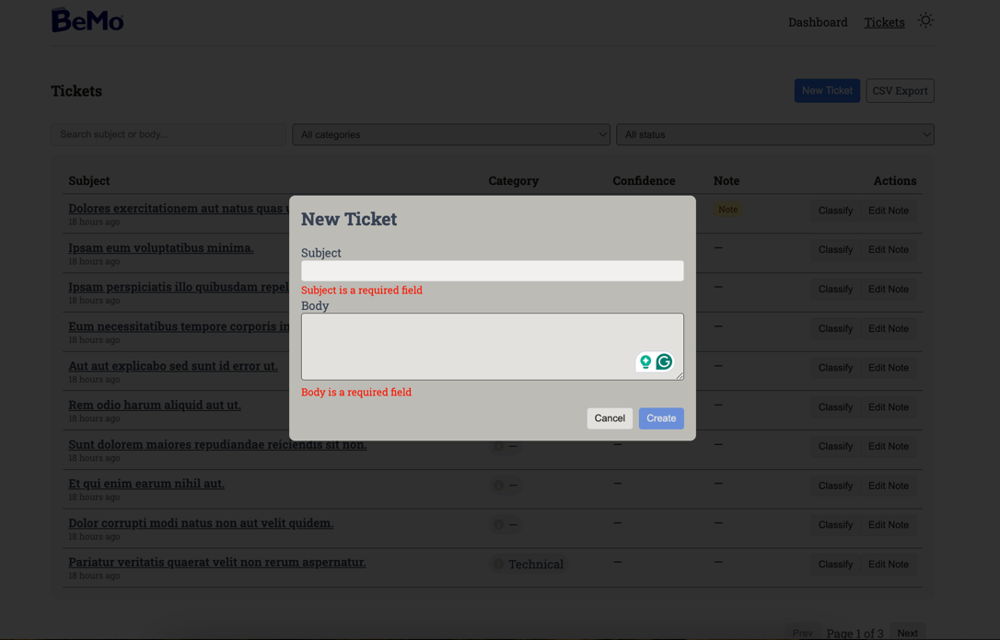

# Bemo

### System Requirements
```md
PHP=8.3
Database=SQLite
yarn=1.22.17 (NPM Might not work, because of a package)
```

### Installation
```shell
git clone git@github.com:bedus-creation/bemo.git
cd bemo
composer install
cp .env.example .env
php artisan key:generate
```

The following .env variables may need to be configured:
```dotenv
APP_URL=http://localhost

DB_CONNECTION=sqlite
#DB_HOST=127.0.0.1
#DB_PORT=3306
#DB_DATABASE=laravel
#DB_USERNAME=root
#DB_PASSWORD=

OPENAI_API_KEY=
OPENAI_ORGANIZATION=
OPENAI_CLASSIFY_ENABLED=false
```

Migrate, seed and build the frontend:
```
php artisan migrate --seed
yarn
yarn build
```

Serve the project
```shell
php artisan serve
```

# Assumptions & Trade-offs

### **Database Design**

```
ticket_categories:
- id
- name

tickets:
- id
- subject
- body
- ticket_category_id
- note 
- status

tickets_classifications:
- id
- ticket_id
- category_id
- confidence
- explanation
```

A `tickets_classifications` table stores AI classification results, allowing reference to original AI predictions even if a user later updates the ticket’s category. The `ticket_category_id` column in `tickets` continues to store the current category.

### **Code Structure & Design Patterns**

- **MVC Pattern:** For simplicity, a minimal MVC structure is used. For larger projects, a domain-driven design (DDD) or similar approach could improve scalability.
- **Query Object:** `App\Queries\TicketListQuery.php` handles ticket filtering and sorting. While I usually prefer the repository pattern with criteria, transformers, and caching, a simple query object is used here for brevity and clarity.

### **Ticket Classification & Rate Limited**

- OpenAI’s [Structured JSON Response API](https://platform.openai.com/docs/guides/structured-outputs) is used for classification.
- Rate limiting is applied in `app/Jobs/TicketClassifierJob.php` (up to 100 jobs/minute).
- Jobs have unlimited retries for processing failures, but exceptions like rate limit errors have a max of 3 retries.
- Keeps the manual value in `tickets` table, and saves all the AI value including category in `ticket_classifications` table

### Seeders

* Have implemented factories for all the classes
* And Tickets seeder with 30 tickets and also options to seed 1 million tickets to test large file exports.

### **CSV Export**

- Core PHP functions (`fputcsv()` and `fopen()`) are used.
- Laravel’s `chunkById()` handles large datasets to avoid memory issues.
- Tested with 1 million tickets successfully.

### **PHPUnit**

- Backend tests cover ~100%, excluding a few unused classes.

### **PHPStan**

- Static analysis enforced at **level 5**, balancing error detection with manageable complexity.

### **Frontend**

- **BEM:** Used for CSS naming; responsiveness and dark theme support can be improved, TailwindCss can be used to make responsive and dark theme more easily
- **Vue Options API:** Options api used to build component, Compositions API, Composables can be good alternatives to break down components more easily.
- **Live Validation:** A package `formjs` by myself integrated with Yup to provide real-time validation, already used in production projects.
- **Dashboard**: Dashboard is build using ChartJs.
- **Dark Theme**: Base variable is defined for dark theme and light theme, and all colors are defined using those CSS variables.

### Optimizations (Future Improvements)

- Throttle requests for ticket search.
- Refactor components and composables for better structure (Options API currently relies on mixins).
- Enhance dark theme colors and overall design.
- Improve responsiveness across devices.


### Some screenshots



